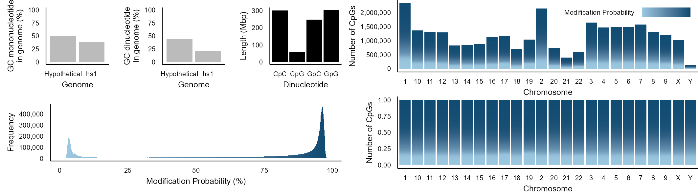
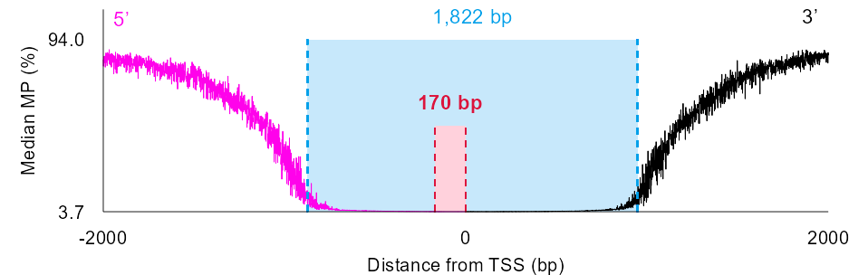

# Overview
This page summarizes all content required to run analyses with custom code and software included in [Epigenomic methylome landscape of promoters in vertebrate genomes (Y. Lee, C. Lee, E.D. Jarvis, H. Kim; 2026)](https://www.biorxiv.org/content/10.64898/2026.03.29.715150v1.full).


1. [findseq.py](#1-findseqpy)
2. [bed_2_tbtools.py](#2-bed_2_tbtoolspy)
3. [intro.R](#3-introR)
4. [plot_profile.R](#4-plot_profileR)
5. [compute_tvd.R](#5-compute_tvdR)
6. [visualize_tvd.R](#6-visualize_tvdR)
7. [scatterplot_gene.R](#7-scatterplot_geneR)
8. [promoter_delineation_calculator.py](#8-promoter_delineation_calculatorpy)
9. [plot_profile_promoter.R](#9-plot_profile_promoterR)
10. [plot_comparison.R](#10-plot_comparisonR)
11. [plot_umap.R](#11-plot_umapR)


# 1. [findseq.py](./findseq/findseq.py)
## System requirement
Runs on Python3. Tested on Python 3.8.10. No non-standard hardware required.
## Installation guide
No installation required. Grant execution permission by `chmod +x findseq.py`
## Demo
Any genome in FASTA format can suffice as input. For demo, the human [hs1 genome](https://www.ncbi.nlm.nih.gov/datasets/genome/GCF_009914755.1/) is recommended as it is the one also used  in the study ([Lee et al., 2026](https://www.biorxiv.org/content/10.64898/2026.03.29.715150v1)). [Download hs1 genome](https://ftp.ncbi.nlm.nih.gov/genomes/all/GCF/009/914/755/GCF_009914755.1_T2T-CHM13v2.0/GCF_009914755.1_T2T-CHM13v2.0_genomic.fna.gz) and unzip (`gzip`) by:
```
wget https://ftp.ncbi.nlm.nih.gov/genomes/all/GCF/009/914/755/GCF_009914755.1_T2T-CHM13v2.0/GCF_009914755.1_T2T-CHM13v2.0_genomic.fna.gz
gzip -df GCF_009914755.1_T2T-CHM13v2.0/GCF_009914755.1_T2T-CHM13v2.0_genomic.fna.gz
```
Run script to find all CpG on hs1 by:
```
python3 findseq.py GCF_009914755.1_T2T-CHM13v2.0_genomic.fna CpG.bed CG
```
Locations of all CpG (CG) occurrences on hs1 in BED format is expected as output. <10 min. runtime expected for human or any average-sized genome.
## Instructions for use
Find dinucleotide (or sequence motif of any length) by:
```
python3 findseq.py <Genome.fasta> <Out.bed> <Motif>
```

# 2. [bed_2_tbtools.py](./bed_2_tbtools/bed_2_tbtools.py)
## System requirement
Runs on Python3. Tested on Python 3.12.8. No non-standard hardware required.
## Installation guide
No installation required. Grant execution permission by `chmod +x bed_2_tbtools.py`
## Demo
Find demo input under bed_2_tbtools/CG.bed (All CpG sites of hs1 chromosome 1). Run script by:
```python3 bed_2_tbtools.py```
Enter input (`CG.bed`) and output (`CG.BINstat.tab.xls`) file names when prompted. Expected output `CG.BINstat.tab.xls` is a tab-delimited file with every 10,000 bp (default) window of genome as row with the length (bp) of CpG in the window is expected. 10 min. runtime expected.
## Instructions for use
Run script while inputting your BED file at prompt. The output is a file summarizing the length of region occupied by the input BED file in every 10,000 bp window of the genome, compatible as input for visualization as a circos plot track in [TBtools](https://github.com/CJ-Chen/TBtools-II) ([Chen et al., 2023](https://www.cell.com/molecular-plant/fulltext/S1674-2052(23)00281-2))

# 3. [intro.R](./intro/intro.R)
## System requirement
Runs on R. Tested on Rstudio/2025.09.2+418 “Cucumberleaf Sunflower” Release powered by R version 4.4.1. No non-standard hardware required.
## Installation guide
Packages `data.table`, `dplyr`, `ggplot2` and `scales` must be installed in R prior to usage.
## Demo
Execute directly on R by blocks specified in the code, preferrably on Rstudio, by importing each input file uploaded under [intro](./intro) ([Fig1b.tsv](./intro/Fig1b.tsv), [Fig1c.tsv](./intro/Fig1c.tsv), [Fig1d.tsv](./intro/Fig1d.tsv), [Fig1e.tsv](./intro/Fig1e.tsv), [Fig1fg.tsv](./intro/Fig1fg.tsv)) to R session before execution of the associated code block as `df` by:
```
df=read.table("<Filename>")
```
e.g. 
```
df=read.table("Fig1b.tsv")
```
and prompting the block. A visualization of figure in the format of [**Fig. 1b-g**](https://www.biorxiv.org/content/biorxiv/early/2026/03/30/2026.03.29.715150/F1.large.jpg) of study ([Lee et al., 2026](https://www.biorxiv.org/content/10.64898/2026.03.29.715150v1)) is expected. Less than 5 minute run time expected for each block.
  

  
## Instructions for use
Import your data by:
```
df=read.table("<Filename>")
```
replacing `<Filename>` with your data before executing a block. The data must be a tab-delimited file with column names specified in each block.

# 4. [plot_profile.R](./plot_profile/plot_profile.R)
## System requirement
Runs on R. Tested on Rstudio/2025.09.2+418 “Cucumberleaf Sunflower” Release powered by R version 4.4.1. No non-standard hardware required.
## Installation guide
Packages `data.table`, `dplyr` and `ggplot2` must be installed in R prior to usage.
## Demo
Declare functions `preprocess_data()` and `create_tss_plot()` from script. Pipe the demo input found under [plot_profile/MP_TSS_hg38.tsv](./plot_profile/MP_TSS_hg38.tsv) through functions: **I.** `preprocess_data()`, **II.** `create_tss_plot()` and **III.** print output.
  
e.g.
```
processed_data <- preprocess_data("MP_TSS_hg38.tsv")
tss_plot <- create_tss_plot(processed_data)
print(tss_plot)
```
A line plot of an average MP profile at transcription start site (TSS) as in format of [**Fig. 2**](https://www.biorxiv.org/content/biorxiv/early/2026/03/30/2026.03.29.715150/F2.large.jpg) of study ([Lee et al., 2026](https://www.biorxiv.org/content/10.64898/2026.03.29.715150v1.full)) is expected. <5 min. runtime expected.


  
## Instructions for use
Prepare a tab-delimited file with columns indicating information on **I.** Vicinal TSS ID, **II.** Distance from TSS, **III.** MP and **IV.** Strand (+/-) for every row corresponding to a CpG. Input the file through the aforementioned pipeline:
```
processed_data <- preprocess_data("Your_file.tsv")
tss_plot <- create_tss_plot(processed_data)
print(tss_plot)
```

# 5. [compute_tvd.R](./compute_tvd/compute_tvd.R)
## System requirement
Runs on R. Tested on Rstudio/2025.09.2+418 “Cucumberleaf Sunflower” Release powered by R version 4.4.1. No non-standard hardware required.
## Installation guide
Packages `data.table` must be installed in R prior to usage.
## Demo
Declare function `compute_tvd_pvalues()` from script. Find inputs compute_tvd/MP_wg_hg38.tsv (MP of all CpGs on hg38 genome) and compute_tvd/MP_TSS_hg38.tsv (MP and distance from TSS for all TSS-vicinal (±10,000 bp) CpGs on hg38). Run function by:
```
compute_tvd_pvalues("MP_wg_hg38.tsv", "MP_TSS_hg38_tsv")
```
A data frame comprising information on p-value at every distance point is expected. 30 hour runtime is expected.
## Instructions for use
Prepare two tab-delimited files: 1. Population (`wg_file`; whole-genome) and 2. sample (`element_file`; region of interest e.g. TSS vicinity). The population file must comprise rows corresponding to every CpG on genome and contain a column with MP information (column 4 by default). The sample file must comprise rows corresponding to CpG inside the region of interest and contain a column with distance, MP and strand information (columns 2, 3 and 4, respectively, by default). Run function by:
```
compute_tvd_pvalues("<population_file>", "<sample_file>")
```

# 6. [visualize_tvd.R](./visualize_tvd/visualize_tvd.R)
## System requirement
Runs on R. Tested on Rstudio/2025.09.2+418 “Cucumberleaf Sunflower” Release powered by R version 4.4.1. No non-standard hardware required.
## Installation guide
No installation required.
## Demo
Start R session and declare function `plot_pvalue_heatmap()` from script. Import demo input found at [visualize_tvd/pvalues_TSS_hg38.tsv](./visualize_tvd/pvalues_TSS_hg38.tsv) to variable `p_values_df` by:
```
p_values_df=read.table("pvalues_TSS_hg38.tsv")
```
Run function with input via
```
plot_pvalue_heatmap(df, "P-value")
```
A horizontally linear heatmap indicating p-value at each distance through color intensity as in [**Fig. 2**](https://www.biorxiv.org/content/biorxiv/early/2026/03/30/2026.03.29.715150/F2.large.jpg) of ([Lee et al. 2026](https://www.biorxiv.org/content/10.64898/2026.03.29.715150v1)) is expected. <5 min. runtime expected.
  

  
## Instructions for use
Prepare a data frame format file with two columns denoting distance from a site of interest and p-value at the distance, most likely an output from [compute_tvd.R](#5-compute_tvdR). Run function by:
```
p_values_df=read.table("<Your_file.tsv>")
plot_pvalue_heatmap(p_values_df, "<Your_title>")
```

# 7. [scatterplot_gene.R](./scatterplot_gene/scatterplot_gene.R)
## System requirement
Runs on R. Tested on Rstudio/2025.09.2+418 “Cucumberleaf Sunflower” Release powered by R version 4.4.1. No non-standard hardware required.
## Installation guide
Package `ggplot2` must be installed in R prior to usage.
## Demo
Start R session and declare function `plot_gene_mp()` from script. Import demo input found under [scatterplot_gene/scatterplot_sample.tsv](./scatterplot_gene/scatterplot_sample.tsv), which contains MPs of CpGs vicinal (±10,000 bp) to the *ACTB* gene on genomes of 63 species and their taxonomic class information, by:
```
df=read.table("scatterplot_sample.tsv")
```
Run function by specifying the column that provides taxonomic class information (`Class`) and +1 class to visualize (`Mammalia`) by:
```
plot_gene_mp(df, "Class", c("Mammalia"))
```
A scatterplot displaying MP of all CpG of mammals at TSS of gene *ACTB*, as an example, as in format of [**Extended Data Fig. 7c**](https://www.biorxiv.org/content/biorxiv/early/2026/03/30/2026.03.29.715150/F13.large.jpg) in study ([Lee et al. 2026](https://www.biorxiv.org/content/10.64898/2026.03.29.715150v1)) is expected. <5 min. runtime is expected.
  

  
## Instructions for use
Prepare a data frame format object in R with columns: `Distance`, `MP` and `Class`, indicating distance from site of interest (e.g. *ACTB* TSS in the case of demo data) and MP of CpG and which class it belongs to, respectively. Run function indicating input file, the column indicating class information and which class you want to visualize
  
i.e.
```
plot_gene_mp(<Data_frame>, <Class_column_name>, <Class_of_interest>)
```
Class must be one or more of: `Mammalia`, `Aves`, `Reptilia`, `Amphibia`, `Sarcopterygii`, `Actinopterygii` and `Chodrichthyes`, concatenated by the `c()` function of R.

# 8. [promoter_delineation_calculator.py](./promoter_delineation_calculator/promoter_delineation_calculator.py)
## System requirement
## Installation guide
## Demo
## Instructions for use

# 9. [plot_profile_promoter.R](./plot_profile_promoter/plot_profile_promoter.R)
## System requirement
Runs on R. Tested on Rstudio/2025.09.2+418 “Cucumberleaf Sunflower” Release powered by R version 4.4.1. No non-standard hardware required.
## Installation guide
Package `ggplot2` must be installed in R prior to usage.
## Demo
Start R session and declare function `plotMedian()` from script. Feed demo input found under [plot_profile_promoter/medianMP_transcriptTSS_T2Thuman.tsv](./plot_profile_promoter/medianMP_transcriptTSS_T2Thuman.tsv) (Median MP profile at TSS of hs1) to function while specifying promoter start (-874), end (948), desired line color (#000000) and core promoter length (170) by:
```
plotMedian("medianMP_transcriptTSS_T2Thuman.tsv", -874, 948, "#000000", 170)
```
A line plot of MP profile at TSS with the promoter and core promoter size indicated as in [**Fig. 5f,g**](https://www.biorxiv.org/content/biorxiv/early/2026/03/30/2026.03.29.715150/F5.large.jpg) and [**Fig. 6**](https://www.biorxiv.org/content/biorxiv/early/2026/03/30/2026.03.29.715150/F6.large.jpg) of study ([Lee et al. 2026](https://www.biorxiv.org/content/10.64898/2026.03.29.715150v1)) is expected. <5 min. runtime expected.


  

## Instructions for use
A tab-delimited file summarizing median methylation probability (MP) values at every distance within ±10,000 bp of site of interest must be provided. Promoter and core promoter sites for the species must be determined beforehand, most likely using [promoter_delineation_calculator.py](#8-promoter_delineation_calculatorpy), and provided as input. Run function via
```
plotMedian("<Filename>", <Promoter_start>, <Promoter_end>, <Color(Hex)>, <Core_size>)
```
to visualize the median MP profile of species.

# 10. [plot_comparison.R](./plot_comparison/plot_comparison.R)
## System requirement
Runs on R. Tested on Rstudio/2025.09.2+418 “Cucumberleaf Sunflower” Release powered by R version 4.4.1. No non-standard hardware required.
## Installation guide
Package `ggplot2` must be installed in R prior to usage.
## Demo
Start R session and precede running whole script by importing demo input found under [plot_comparison/comparison_sample.tsv](./plot_comparison/comparison_sample.tsv) as `df` via
```
df=read.table("comparison_sample.tsv")
```
A scatterplot figure in the format of [**Fig. 5h-j**](https://www.biorxiv.org/content/biorxiv/early/2026/03/30/2026.03.29.715150/F5.large.jpg) of study ([Lee et al. 2026](https://www.biorxiv.org/content/10.64898/2026.03.29.715150v1)) is expected.
## Instructions for use
Organize your calculated promoter lengths for individual species beforehand into a data frame format with columns: `Class`, `Genome.size` and `Promoter.size`. Precede prompting of the script with input importing:
```
df=read.table("<Your_promoter_sizes.tsv>")
```

# 11. [plot_umap.R](./plot_umap/plot_umap.R)
## System requirement
Runs on R. Tested on Rstudio/2025.09.2+418 "Cucumberleaf Sunflower" Release powered by R version 4.4.1. No non-standard hardware required.
## Installation guide
Package `ggplot2` must be installed in R prior to usage.
## Demo
Start R session and declare function `plot_UMAP()` from script. Import demo input found under [plot_umap/umap_sample.tsv](./plot_umap/umap_sample.tsv), which contains organic UMAP component values from MP properties of 83 vertebrate species in an R data frame format, by:
```
df=read.table("umap_sample.tsv", header=T)
```
UMAP values in demo data were generated using function `umap()` from R package [uwot](https://github.com/jlmelville/uwot). Subsequently, the data frame was preprocessed to include taxonomic class information of species in the column `Class`. Invoke visualization, using the color coding scheme provided as an R vector object in the script (`class_color`), by:
```
plot_UMAP(df, "Your title", df$Class, class_color)
```
A scatterplot summarizing UMAP components in a two-dimensional space as in the format of [**Fig. 4**](https://www.biorxiv.org/content/biorxiv/early/2026/03/30/2026.03.29.715150/F4.large.jpg) of study ([Lee et al. 2026](https://www.biorxiv.org/content/10.64898/2026.03.29.715150v1)) is expected.


  
## Instructions for use
Organize UMAP result into a data frame format with columns `UMAP1` and `UMAP2` for the top two UMAP components, preferrably generated by `umap()`. Specify column name (`<Column_name>`) containing information for color coding (e.g. phylogenetic class or tissue type). Specify a vector defining color coding scheme. Run via
```
plot_UMAP(<Data_frame>, <Title>, <Column_name>, <Color_coding_scheme>)
```
